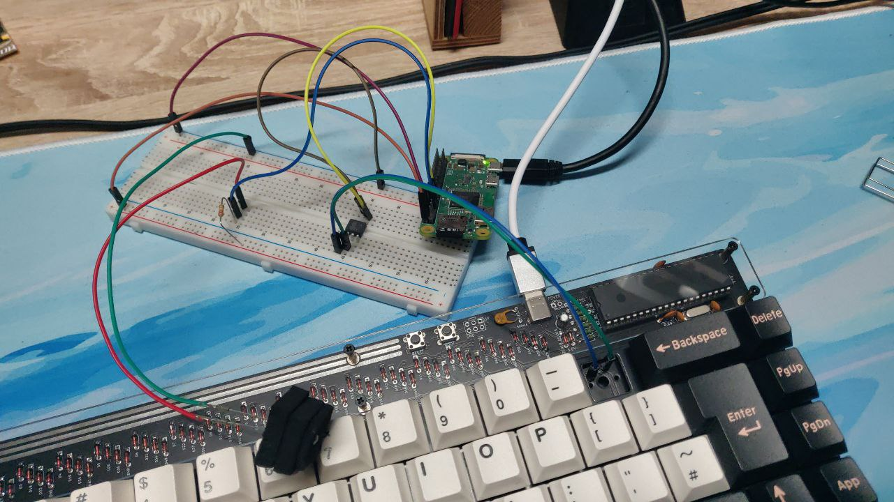

# FLAT - Free Latency Analysis Toolkit

Toolkit for measuring input-to-photon delay.

Install [`./blink/`](./blink/) on the system you want to measure.

Install [`./timekeeper/`](./timekeeper/) on a Raspberry Pi.

Connect the passive electronics to the Raspberry as described in [`./hardware/`](./hardware/)

```
root@raspberrypi:~/FLAT/timekeeper/bin# node index.js
{ sampleSize: 100, startDelay: 5, cooldown: 500, keypressDuration: 40 }
Starting Measurement in 5 seconds
Starting Measurement
progress: 100/100
average:19322.33
median:19240.5
deviation: 1969.6494896864824
variance: 3879519.1122222207
done
root@raspberrypi:~/FLAT/timekeeper/bin#
```


