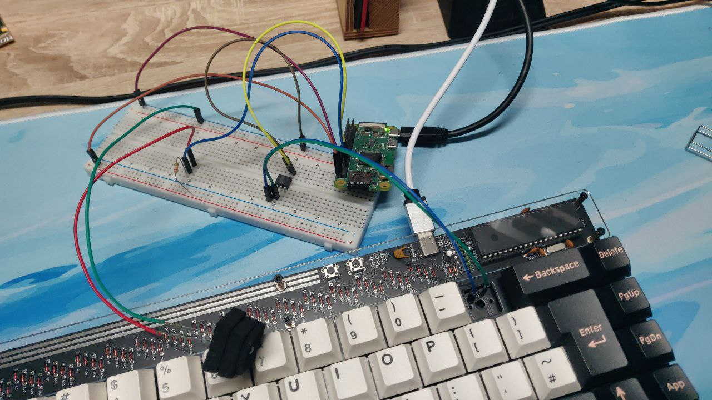

# Hardware - Free Latency Analysis Toolkit

The hardware is a major WIP with any help appreciated. I'm an absolute beginner in with electronics and just threw parts together until it "worked".

The NPN phototransistor is a [L-7113P3C KB](https://www.reichelt.de/de/en/phototransistor-npn-20-tht-5mm-l-7113p3c-kb-p219707.html), for absolutely no particular reason. Tried it and it worked.

